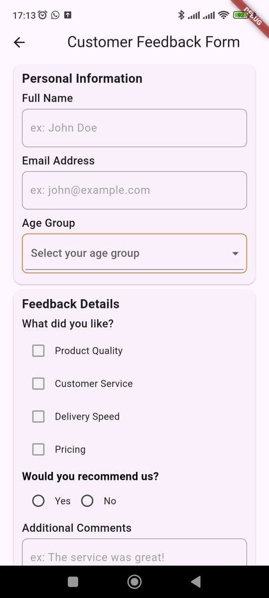
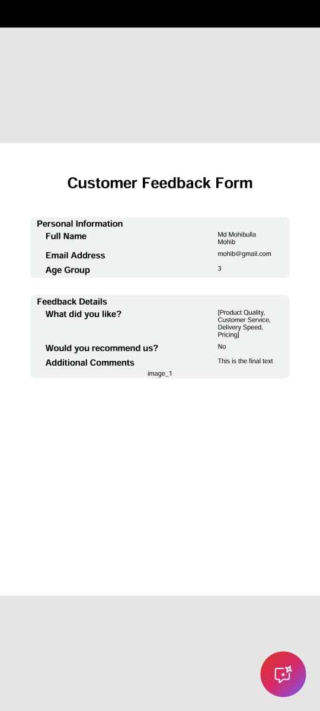

# 📋 Dynamic Form App

A Flutter application to dynamically render and submit survey forms configured through a JSON files.
In this project i build demonstrate dynamic UI rendering, clean architecture, and PDF generation
from user input.

---

## 🚀 Features

- 📄 **Form List Page** – View list of available forms get from json files.
- 📝 **Dynamic Form Page** – Forms rendered from JSON:
    - Text Fields
    - Dropdown (Single)
    - CheckBox for Multiple Option selection
    - Yes/No/NA Radio Buttons
    - Image Picker (Camera/Gallery)
    - PDF Invoice Generate
- **Validation Support** – Field-level validation before submission.
- **Submission View Page** – View submitted data and save as a PDF.
- 📁 PDF saved to device storage under `/MyAppDocuments` folder.
- ✅ Clean architecture.
- 📦 Uses `Bloc` for state management.

---

## 📦 Tech Stack

| Technology         | Usage                          |
|--------------------|--------------------------------|
| Flutter            | Cross-platform framework       |
| Bloc               | State management               |
| pdf                | PDF generation                 |
| image_picker       | Pick image from gallery/camera |
| path_provider      | Access storage directories     |
| permission_handler | Manage runtime permissions     |

---

## 📱 Screenshots

| Form List                               | Dynamic Form                       | Submission View                         | PDF Invoice                               |
|-----------------------------------------|------------------------------------|-----------------------------------------|-------------------------------------------|
|  |  |  |  |

## 🔧 Getting Started

### 1. Clone the repository:

```bash
git clone https://github.com/bayazidHossain2/dynamic_forms.git
cd dynamic_form_app
flutter pub get
flutter run
